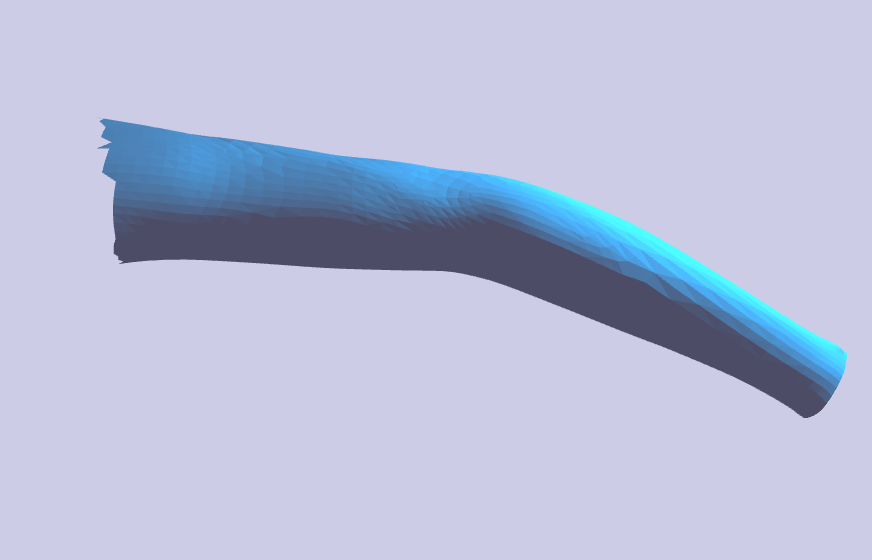

# Blending Operators
We utilize Hermite radial basis functions (HRBFs) to specify the surface associated with each bone of a skeleton implicitly as a level set. These functions are particularly useful when creating realistic blends/unions between intersecting joints. This repository features implementations of some of these blending operators and surface tracking techniques detailed in the references below. 

The algorithm works by first performing a preliminary computation step which solves a system of linear equations as big as the number of verticies times 4 to determine coefficients for the HRBF function. When a joint is deformed all the verticies are first just transformed according to their bone coordinates (this causes edges to separate). As described in the papers, every vertex is then moved closer to its barycentric center which closes these gaps introduced. In [1] the factor that determines how much a vertex conforms to its barycentric center is defined as &mu;. I found more success with a slightly modified value of &mu;.

This step is interleaved with a tangenital relaxation scheme that moves each vertex closer to its iso value as defined by the chosen composition function. The factor governing how much of a vertex's movement is effected by this tangental relaxation step is detailed in [1] as &alpha;. This constant is specified in the command line as a user defined parameter. 

However, I discovered an issue with this process since it doesn't actually project each point onto its exact iso value. This resulted in a bumpy or in extreme cases, jagged surface. Because of this I added an additional step that uses the typical cotangent convolution filter to smooth the amount by which the verticies change during the tangential relaxation step. This step generally keeps points close to their iso value while not introducing ugly bumps. The factor by which this process effect the verticies is another user specified parameter, &lambda;, from the command line.

This program defines a mesh class which describes a bone rather than an entire mesh. An example of using the Mesh's methods to create a bone structure and apply a deformation is shown in ```initializeMesh()``` of main.cpp. To test this program I mainly relied on two specific joints, a finger and elbow joint. Examples of applying deformations to these are shown below.

<br />
Original mesh

<br />
Wire Frame after deformation

<br />
Result of deformation


<br />
Original mesh

<br />
Wire Frame after deformation

<br />
Result of deformation


This program's dependencies include OpenGL, GLU, GLEW, SDL2, and the Eigen and libigl c++ libraries and is written in the C++11 standard.

run ```make all``` to compile the program.

A necessary first step that must be performed for each mesh before any kind of manipulation or viewing is to calculate the coefficients of the HRBF function which comes down to solving a system of equations 4 times the size of the number of verticies.

```./out hrbf objs/<file>.obj ```

This process outputs a .hrbf file that is read during the viewing process. For the existing objects in this repository they are already calculated.

Next we can run the viewer with 

```./out viewer <alpha> <lambda> <face_visible>```

The parameters ```alpha``` and ```lambda``` (both &lt; 1) are floats, the former describing the degree to which we try to conform to the iso surface during our tangential relaxation process. I've found that low decimals around 0.01 to work best. The latter parameter controls the degree to which smooth the surface during tangential relaxation. ```face_visible``` determines whether we display the wire frame (0) or actual surfaces with faces (1). 

##TODO:
* Add support for multiple joints and incorporate parent/child relationships among the nodes.
* Put verticies in normals inside a VBO instead of calling the gl functions.
* Add more images for examples of deformations.
* Re-determine edge correspondence between meshes when twisting. This would solve the twisting problem introduced by our surface tracking method.

##References:
[1] ACM Reference Format Vaillant, R., Barthe, L., Guennebaud, G., Cani, M., Rohmer, D., Wyvill, B., Gourmel, O., Paulin, M. 2013. Implicit Skinning: Real-Time Skin Deformation with Contact Modeling. ACM Trans. Graph. 32, 4, Article 125 (July 2013), 11 pages. DOI = 10.1145/2461912.2461960 http://doi.acm.org/10.1145/2461912.2461960.
 
[2] Olivier Gourmel, Lo ̈ıc Barthe, Marie-Paule Cani, Brian Wyvill, Adrien Bernhardt, et al.. A
Gradient-Based Implicit Blend. ACM Transactions on Graphics, Association for Computing
Machinery (ACM), 2013, 32 (2), pp.Article No. 12. <10.1145/2451236.2451238>. <hal-
00753246>
 
[3] ACM Reference Format Vaillant, R., Guennebaud, G., Barthe, L., Wyvill, B., Cani, M. 2014. Robust Iso-Surface Tracking for Interactive Character Skinning. ACM Trans. Graph. 33, 6, Article 189